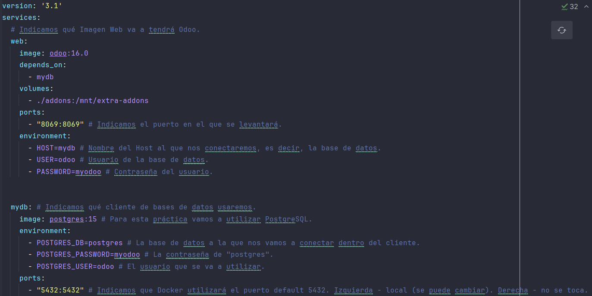
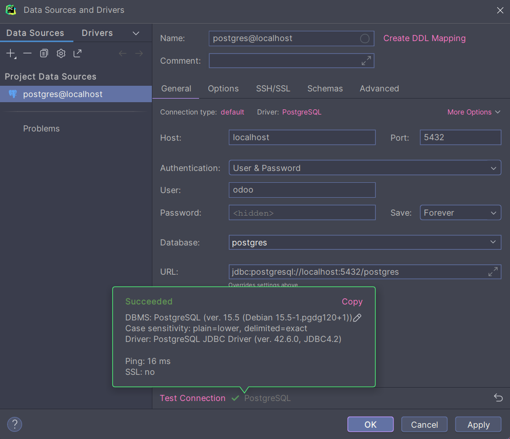
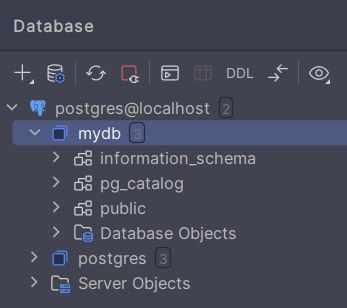
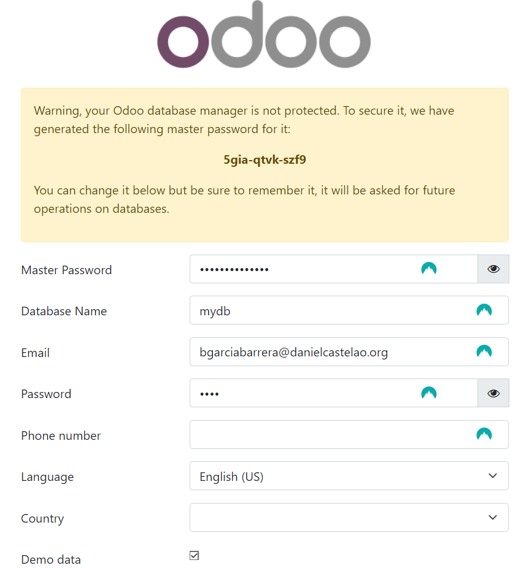
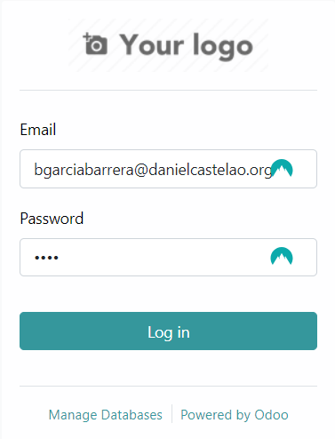
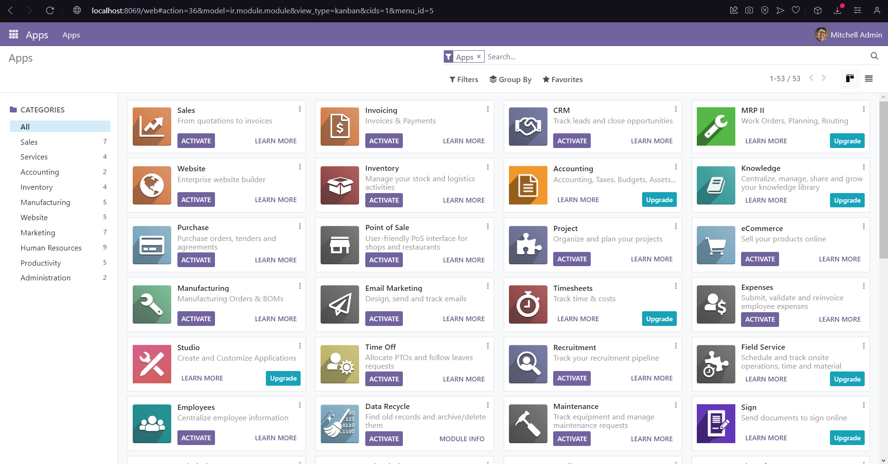

# Instalación de Odoo
## Con Docker y Docker Compose
En primer lugar, debemos asegurarnos de que tenemos una instalación válida de Docker. Una vez estemos seguros de ello, utilizaremos PyCharm para trabajar en nuestro `docker-compose.yml`.

## 1. Estructura docker-compose.yml



Tal y como podemos apreciar en la imagen, utilizaremos la imagen Odoo 16.0. También se puede comprobar el cliente de bases de datos que utilizaremos, que en este caso será PostgreSQL.

Si por algún motivo el puerto `5432` estuviese ocupado por otro proceso, Docker no podría utilizarlo para exponer nuestro contenedor a la base de datos a la que lo vamos a enlazar. Para solventar este problema, podemos mapear un puerto diferente en nuestro ordenador local al puerto '5432' del contenedor de PostgreSQL.
En este caso, sería tan sencillo como cambiar el actual puerto...

```
ports:
    - "5432:5432"
```

...por otro puerto, así:

```
ports:
    - "5433:5432"
```
De esta forma, Docker utilizará el puerto `5433` de nuestro ordenador local para acceder al contenedor PostgreSQL, evitando conflictos con el puerto ocupado.

## 2. Configuración de PostgreSQL

> [!IMPORTANT]
> Para llevar a cabo este paso, antes es necesario levantar nuestro Docker con el comando `docker compose up -d`.



Rellenamos los campos necesarios con nombre de usuario y contraseña, asegurándonos de que el puerto es el correcto así como la base de datos. Podemos comprobar que la conexión es exitosa y, acto seguido, aplicar los cambios y aceptar.

Como se puede comprobar en la siguiente imagen, PostgreSQL está integrado en nuestro IDE, lo que nos permitiría hacer consultas desde el mismo, así como otras funciones de las que necesitásemos hacer uso.



## 3. Configuración de Odoo

Es necesario añadir una nueva base de datos a Odoo, por lo que al entrar en nuestro navegador por primera vez se nos solicitará que rellenemos los campos necesarios con la información adecuada.

> [!IMPORTANT]
> ¡Es importante recordar que debemos marcar la casilla `Demo data`!



A continuación, tras la creación de la base de datos, podremos iniciar sesión con el correo y contraseña que hemos proporcionado en el paso anterior.



Finalmente, tras haber iniciado sesión, nos encontraremos en el apartado `Apps` de nuestro sitio alojado en `localhost:8069`.


